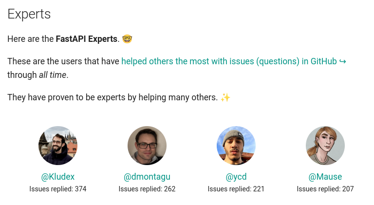
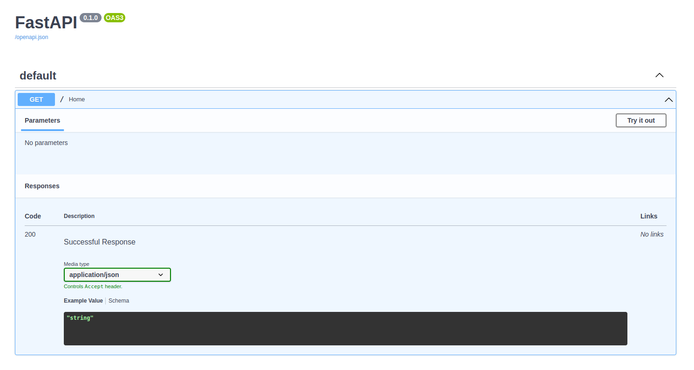
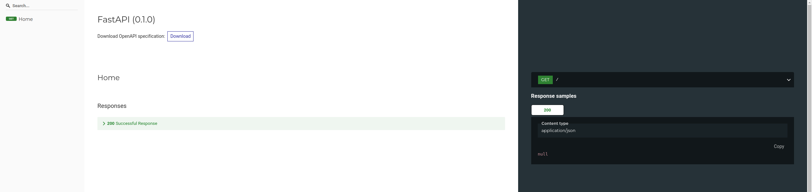
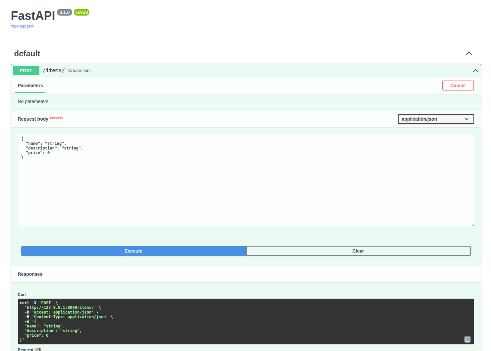
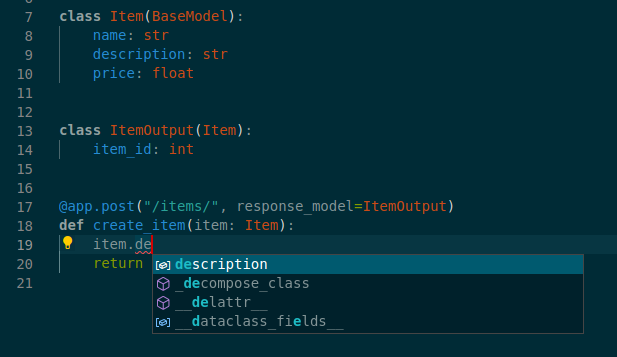

# Getting Started with FastAPI

Marcelo Trylesinski

---

# About me

---

## FastAPI Expert

---

## OSS Maintainer

### Uvicorn

---

## OSS Maintainer

### Starlette

---

## What is FastAPI?

**FastAPI** is a modern web framework used to build APIs based on Python type hints.

---

## Why FastAPI?

- Fast Development
- Easy to learn
- Intuitive
- Fewer bugs

---

# FastAPI Application

[Run it yourself!](https://github.com/Kludex/fastapi-workshop/blob/main/slides/src/1_fastapi_features/main.py)

---

## Path Parameters

[Run it yourself!](https://github.com/Kludex/fastapi-workshop/blob/main/slides/src/1_fastapi_features/path_params.py)

---

## Query Parameters

[Run it yourself!](https://github.com/Kludex/fastapi-workshop/blob/main/slides/src/1_fastapi_features/query_params.py)

---

## Request Body

[Run it yourself!](https://github.com/Kludex/fastapi-workshop/blob/main/slides/src/1_fastapi_features/body_params.py)

---

## Header Parameters

[Run it yourself!](https://github.com/Kludex/fastapi-workshop/blob/main/slides/src/1_fastapi_features/header_params.py)

---

## Documentation (`/docs`)

---

## Documentation (`/redoc`)

---

## Data Validation

---

## Data Validation

---

## Data Validation (`/docs`)

---

## Autocomplete

---

## Dependency Injection

---

## Background Tasks

[Run it yourself!](https://github.com/Kludex/fastapi-workshop/blob/main/slides/src/1_fastapi_features/background_tasks.py)

---

## WebSockets

---

# FastAPI Features

https://fastapi.tiangolo.com/features/

---

## Q&A

---

## Hands-on FastAPI

---

## The Project

The project we are going to create is a simple API that allows us to create, read, update and delete items.

1. The items will have a name and a price.
2. We will store the items in a database.
3. We will be able to retrieve the items, create new items, update existing items and delete items.
4. We will be able to retrieve a single item with a specific name.
5. We will be able to retrieve only the items that cost less than a specific price.

---

## Create the Project

Follow up on [FastAPI Workshop](https://github.com/Kludex/fastapi-workshop/).

---

## Exercise: Test the application

---

## Q&A

---

## Let's Deploy!

---

## Let's Deploy!

Install [Google Cloud SDK](https://cloud.google.com/sdk/docs/install-sdk)

(If you are on Ubuntu: `snap install google-cloud-cli --classic`)

---

## Let's Deploy!

Read [FastAPI documentation](https://fastapi.tiangolo.com/deployment/) about deployment

---

## Q&A

---

## How to proceed from here?

Read the documentation: https://fastapi.tiangolo.com/

---

## You can help the FastAPI Community

1. Answer issues
2. Join the Discord server
3. Help on underneath projects like Starlette and Pydantic

---

## Follow me

- Twitter: https://twitter.com/marcelotryle
- GitHub: https://github.com/kludex
- LinkedIn: https://www.linkedin.com/in/marcelotryle/

---

## Q&A

